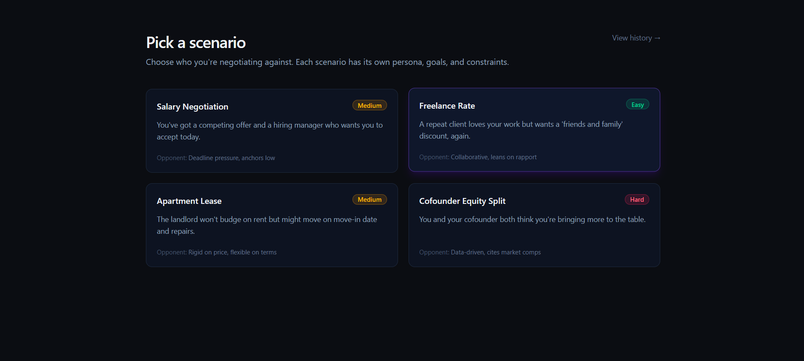
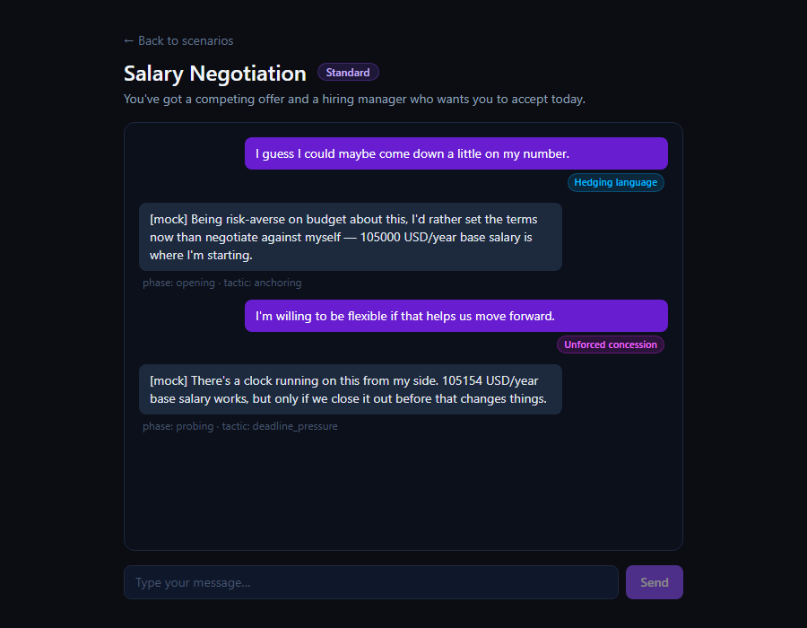
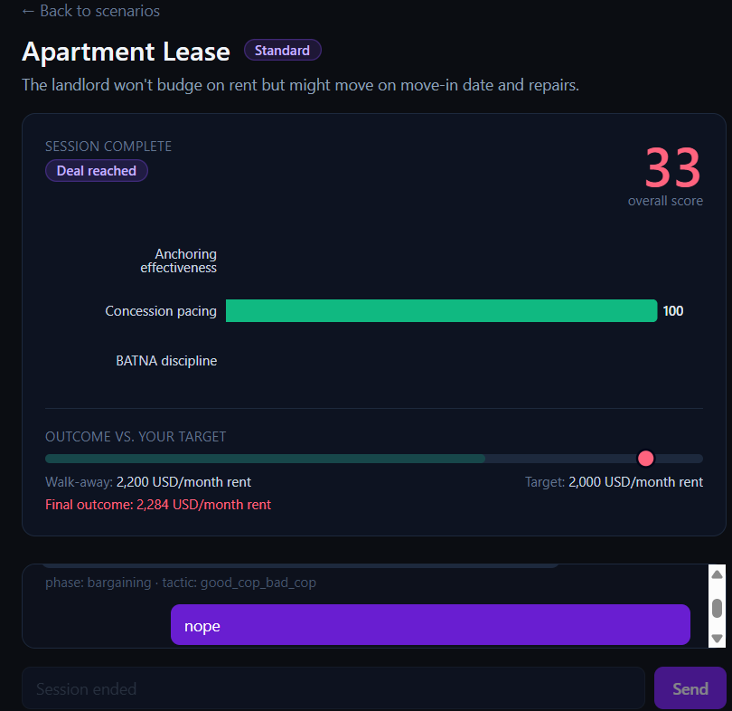
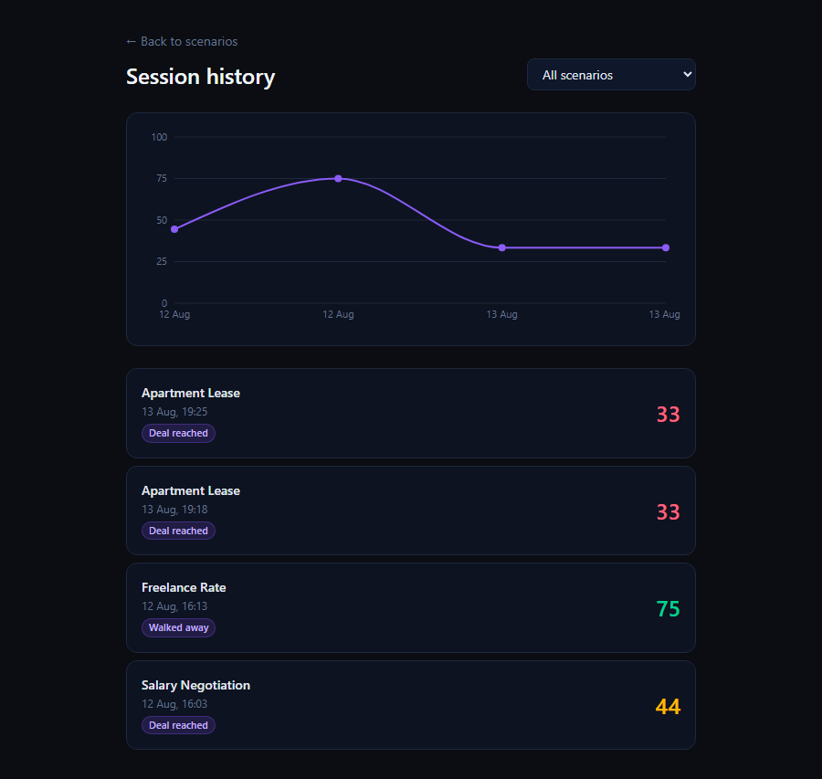
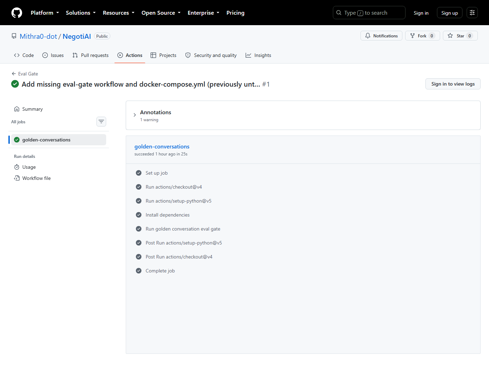
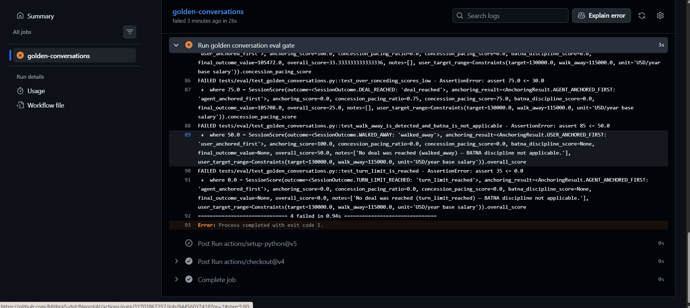

# NegotiAI

**Practice negotiating against an adaptive AI opponent, and get scored on it — with the scoring and A/B-testing infrastructure built to the same rigor as the product itself.**


*The landing screen — four negotiation scenarios, each with its own persona, difficulty, and opponent style hint.*

## Why this exists

Negotiation is a skill people rarely get to rehearse before it matters — a salary offer, a lease renewal, a cofounder split. NegotiAI is a practice ground: pick a scenario, negotiate against a persona-driven AI opponent that tracks the conversation and adapts its tactics, and walk away with a structured scorecard instead of a vague feeling about how it went.

It's also, deliberately, a demonstration of how to build the less glamorous half of an AI product properly: a rule-based classifier picked over an ML model on purpose, a real statistical testing pipeline (not eyeballed A/B results), a documented scoring limitation instead of a hidden one, and a CI gate that's actually been shown catching a real regression — not just wired up and left untested.

## Architecture

```
frontend/ (React + Vite + TS + Tailwind)
   │  POST /chat  { scenario_id, message, turn_number, history, variant }
   ▼
backend/app/main.py  ──────────────────────────────────────────────┐
   │                                                                │
   │  persona lookup (app/personas/)                                │
   ▼                                                                │
backend/app/chat_pipeline.py :: run_chat_turn()                     │
   │                                                                │
   ├─ app/strategies/  → phase (opening→probing→bargaining→closing)  │
   │                     + tactic, via the selected StrategyVariant  │
   ├─ app/classifier/  → rule-based concession-signal detection      │
   ├─ app/agent/       → the opponent's reply (real Claude call, or  │
   │                     MOCK_LLM canned replies — same interface)   │
   └─ app/scoring/     → session-end detection + SessionScore        │
                                                                      │
   best-effort persistence → app/history/ (Postgres `sessions`) ─────┘

backend/eval/  — the simulated A/B testing side, reusing run_chat_turn()
   simulated_user.py / mock_user.py  → an LLM (or mock) plays a user archetype
   run_simulation.py                 → N synthetic sessions → `simulated_sessions`
   statistics.py / compare_variants.py → Welch's t-test / Mann-Whitney U
```

One thing worth calling out: **the simulated A/B testing layer isn't a separate scoring path** — `eval/run_simulation.py` drives synthetic sessions through the exact same `run_chat_turn()` the real `/chat` endpoint uses, so a simulated session's `SessionScore` is produced by identical code to a human session's. If the scoring logic changes, both change together; there's no risk of the eval infra silently drifting from what a real user experiences.

### Directory map

| Path | What's there |
|---|---|
| `frontend/src/pages/`, `components/` | Scenario picker, chat UI, scorecard, session history + trend chart |
| `backend/app/personas/` | Per-scenario persona config (goals, target/walk-away constraints) — data files, not inline strings |
| `backend/app/strategies/` | `default.py` / `hardline.py` tactic-selection policies + `registry.py` dispatch |
| `backend/app/classifier/` | Rule-based concession-signal detector (`rules.py` is data-only, `classifier.py` is the matcher) |
| `backend/app/agent/` | The opponent's reply generation — `llm.py` (real Claude), `mock.py` (MOCK_LLM), `prompts.py` |
| `backend/app/scoring/` | Session-end detection (`outcome_detection.py`) + `SessionScore` computation (`scorer.py`) |
| `backend/app/history/` | Human session persistence (Postgres `sessions` table) |
| `backend/eval/` | Simulated A/B testing: synthetic user generation, strategy-variant comparison, statistics |
| `backend/tests/` | 109 pytest tests, including `tests/eval/test_golden_conversations.py` (the CI eval gate) |
| `.github/workflows/eval-gate.yml` | Runs the golden-conversation tests on every push/PR to `main` |

## Key technical decisions

### A rule-based classifier, not a model

The concession-signal classifier (`backend/app/classifier/`) flags hedging, urgency, premature agreement, and unforced concessions using plain regex patterns (`rules.py`) — not a fine-tuned or off-the-shelf transformer, despite that being the original plan. This was a deliberate call: the signal types are narrow and phrase-driven ("I could come down to...", "I'm willing to...", "sounds good"), a regex match is instant and free, the behavior is fully deterministic and unit-testable, and every pattern is inspectable in one file instead of living inside model weights. The cost is real — it can't catch a concession phrased in a way no pattern anticipated, and it's not going to generalize the way an embedding-based classifier would. For a negotiation-training tool where the tactic layer and the eval gate both need *reproducible* signal detection, that tradeoff favored regex.

### Statistical test selection (`backend/eval/statistics.py`)

Comparing `overall_score` between strategy variants needed an actual decision procedure, not a hardcoded t-test:

1. **Shapiro-Wilk** checks each group's normality — the most powerful normality test at the sample sizes this project runs at (tens to low hundreds).
2. Below 8 samples per group, or on a zero-variance (constant) group, the check is skipped rather than trusted — a normality test on too few points has no real power, so "it passed" would be a false signal. This routes straight to the nonparametric branch.
3. Both groups pass (p > 0.05) → **Welch's t-test** (not Student's — no reason to assume equal variance between two different strategy policies). Either fails → **Mann-Whitney U**, the standard nonparametric analog.
4. Below 3 samples per group, neither test is meaningful, so the comparison refuses to run rather than returning a number that looks like a real result.

The 95% confidence interval is **always** Welch's t-interval on the difference in means, regardless of which test supplied the p-value — Mann-Whitney's own natural interval (Hodges-Lehmann) is a different, median-based quantity, and reporting that under a "CI on the difference in means" label would misrepresent it.

### MOCK_LLM: a real dual path, not a stub

Every opponent reply goes through the same `generate_reply()` interface (`backend/app/agent/llm.py`) whether it's calling the real Anthropic API or, with `MOCK_LLM=true`, drawing from canned reply pools (`app/agent/mock.py`). The mock path isn't a flat stub — it interpolates a bounded, randomized "concession" number per tactic (`app/mock_numbers.py`), so mock sessions produce realistic-*looking*, varying negotiation numbers without any API cost. This is what makes the whole eval/A-B pipeline runnable at zero cost: `eval/run_simulation.py` can generate 30+ full synthetic sessions per strategy variant in seconds.

### The BATNA scoring heuristic — and its documented limitation

`BATNA discipline` (one of the three `SessionScore` sub-scores) needs to know the final agreed value, but nothing in this app does structured offer-tracking — everything is free text. `scorer.py::_extract_final_outcome()` takes the **last recognizable number anywhere in the transcript** as a best-effort stand-in, explicitly flagged in the score's `notes` whenever no number is found rather than silently guessing.

This heuristic has a real, discovered consequence, not just a theoretical one — see the A/B testing section below.

## Demo


*Each opponent reply is captioned with the strategy state machine's phase/tactic; each user message gets live concession-signal tags the moment the classifier runs.*


*Anchoring, concession pacing, and BATNA discipline sub-scores, plus outcome vs. target/walk-away — computed by the same `compute_session_score()` real and simulated sessions both use.*


*Past sessions with an overall-score trend line, reusing the scorecard's status-color tokens.*

## The A/B testing methodology — and an honest result

The stretch goal from the project spec was a *simulated* A/B test comparing negotiation strategy variants with real statistics, not eyeballed transcripts. That's built: `eval/user_types.py` defines three simulated-user archetypes (aggressive, passive, data-driven), `eval/run_simulation.py` runs each through the real `run_chat_turn()` pipeline against either strategy variant — `default` (adapts: escalates on concessions, eases off if the user holds firm) or `hardline` (never eases off, leans on `deadline_pressure` almost everywhere) — and `eval/compare_variants.py` runs the Welch/Mann-Whitney comparison above on the results.

**Running it for real** — 30 simulated sessions per variant, `salary-negotiation`, aggressive user archetype, `MOCK_LLM=true`:

```
     default: n=30   mean=86.67  std=16.61
    hardline: n=30   mean=87.78  std=16.34
Test: mann_whitney_u   p=0.7991  →  not significant
Mean difference (hardline - default): 1.11   95% CI: [-7.40, 9.63]
```

**Not significant.** A second run with the passive archetype came back the same way (p=0.81, means 55.6 vs 57.0). I'm reporting that as-is rather than reframing it — the point of building real statistical infrastructure was precisely to get an honest answer instead of a hand-wavy "yes, hardline is tougher."

**Why, specifically** — this traces to the BATNA heuristic above, not to noise. `_extract_final_outcome()`'s "last number in the transcript" is, in practice, almost always the **agent's own** most recently cited figure — the user's closing line ("I accept your offer") never itself carries a number. The agent's cited numbers live inside *its own* target–walk_away range (for `salary-negotiation`, roughly $105k–$122k). Even at `hardline`'s most concessive available range and `default`'s outright most concessive tactic (`good_cop_bad_cop`, up to ~45% of the agent's own range), the resulting figure doesn't cross the *user's* walk-away threshold ($115k) — so `batna_discipline_score` clamps to roughly 0 on nearly every deal-reached session, **for both variants**, structurally diluting the one score component that should actually differ by strategy.

In other words: the variance-fix pass (making mock sessions produce real, non-degenerate scores) worked — scores now vary meaningfully session to session. But the specific channel that should carry a *variant* signal (how much the agent concedes) gets washed out by how the final value is attributed, before the statistics ever see it. That's a scoring-heuristic finding, uncovered *because* the comparison was done rigorously rather than skipped — the honest conclusion from this data is "no detectable difference," and a real fix would mean revisiting how `final_outcome_value` is attributed (e.g. only ever taking the *user's* own cited number, or tracking a real running offer instead of scanning free text), not re-running the same comparison hoping for a different p-value.

## CI eval gate

`backend/tests/eval/test_golden_conversations.py` — four hand-scripted negotiation conversations (clean deal with good anchoring, over-conceding, walk-away, turn-limit) run through the real `run_chat_turn()` pipeline, asserting both the outcome type and an `overall_score` range wide enough to survive a legitimate scoring reweight but tight enough to catch a real regression. It's deterministic despite `MOCK_LLM`'s randomized reply text — an autouse fixture pins `random.choice`/`random.uniform` for the file's duration, verified by running it back-to-back and diffing the output. `.github/workflows/eval-gate.yml` runs just this file on every push/PR to `main` — no database, no API key needed, since `run_chat_turn()` has no DB dependency and mock mode never reaches the Anthropic client.

This has been exercised on a real PR, not just written and trusted: a branch was deliberately edited to change the scoring output, opened as a PR against `main`, and the check failed immediately —


*The gate green on a normal change — the baseline it's meant to protect.*


*"Deliberately break scoring for CI demo" — all 4 golden tests fail with the real pytest assertion output (e.g. `assert 75.0 <= 30.0` for the over-conceding case), and the PR shows "All checks have failed," which would block a merge.*

## Tech stack

| Layer | Choice | Notes |
|---|---|---|
| Frontend | React 19 + Vite + TypeScript + Tailwind v4 | Dark theme only; Recharts for the scorecard/trend visualizations |
| Backend | FastAPI (Python 3.11) | Pydantic v2 throughout |
| Database | PostgreSQL (via Docker Compose) | Not SQLite — Render's disk is ephemeral; SQLite is used only as an in-memory pytest fixture for repository tests |
| LLM orchestration | LangChain + Anthropic (`langchain-anthropic`) | `claude-sonnet-5`; `MOCK_LLM=true` swaps in canned replies behind the same interface |
| Concession classifier | Rule-based (regex) | Deliberately not a model — see "Key technical decisions" |
| Statistics | scipy (`scipy.stats`) | Shapiro-Wilk, Welch's t-test, Mann-Whitney U. `statsmodels` isn't used — nothing in this codebase yet needs it over plain `scipy.stats` (a chi-squared/proportions test on outcome rates would be the natural reason to add it) |
| CI/CD | GitHub Actions | `eval-gate.yml`, scoped to the golden-conversation test file |
| Containerization | Docker Compose | Postgres only, for local dev |
| Testing | pytest | 109 tests as of this writing |

Two things from the original project spec that **aren't** built: MLflow experiment tracking (`eval/`'s simulation results are just Postgres rows today) and a live Render deployment. Both are reasonable next steps, not silently dropped — noting them here rather than implying they exist.

## Local setup

### Prerequisites
- Python 3.11, Node 18+, Docker Desktop

### Backend

```bash
cd backend
python -m venv venv
source venv/Scripts/activate   # or venv/bin/activate on macOS/Linux
pip install -r requirements.txt

cp .env.example .env
# For a zero-cost local demo, no Anthropic key needed — just set:
#   MOCK_LLM=true
# in .env. Leave it false and set ANTHROPIC_API_KEY to talk to the real model.

cd ..
docker compose up -d           # starts Postgres on :5432

cd backend
uvicorn app.main:app --reload --port 8000
```

### Frontend

```bash
cd frontend
npm install
npm run dev                    # http://localhost:5173
```

### Running the tests

```bash
cd backend
source venv/Scripts/activate
pytest                         # full suite (109 tests)
pytest tests/eval/test_golden_conversations.py -v   # just the CI eval gate
```

### Running a simulated A/B comparison locally

```bash
cd backend
# MOCK_LLM=true in .env keeps this free — no API calls
python -m eval.run_simulation --scenario-id salary-negotiation --user-type aggressive --n 30 --variant default
python -m eval.run_simulation --scenario-id salary-negotiation --user-type aggressive --n 30 --variant hardline
python -m eval.compare_variants --scenario-id salary-negotiation --user-type aggressive
```
